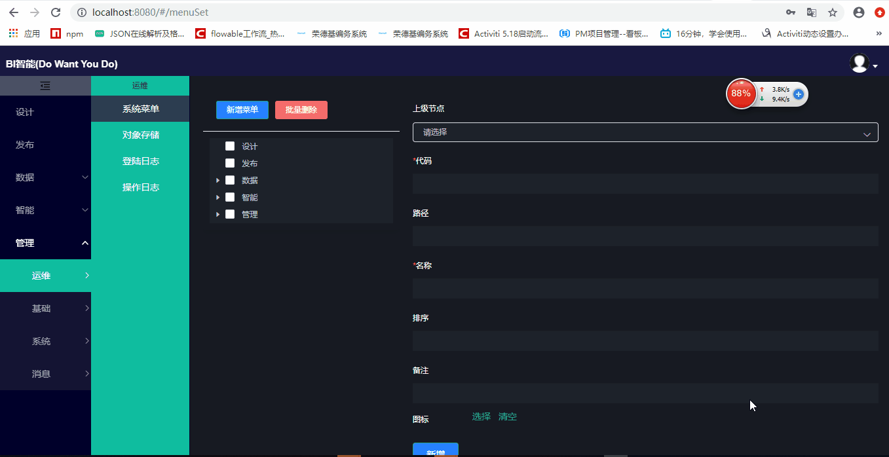

# 数据挖掘

传统大数据分析工具以Hadoop、Spark为代表，集成了大量的技术框架，
对用户来说又重又笨又不灵活，难以维护和驾驭，国际和国内的敏捷型BI工具在对接时又面临性能、友好性、定制化能力弱的缺点。
本项目独辟蹊径，以阿里开源的DataX为ETL工具，
以列式数据库ClickHouse做为中间数据存储源，通过视图关联构建大数据集，解决亿万级数据的即时分析性能，再辅以强大的数据可视化设计前端，
通过用户自定义菜单和模板进行呈现，实现用户的自助式分析和探索。


 >通过灵活的预警功能，设置一些自定义的监控指标，当监控指标超过异常值时，
 系统会自动以短信、邮件或微信、钉钉等消息推送至相关人员,变原来的被动查询为主动推送,这样就能够及时发现问题。
 
 >通过结合人工智能算法的预测模型，可以就未来的趋势做一下预测。
 
 通过以上的技术实现，实现企业不同数据源的集中整合，统一呈现
 
## 技术栈

采用前后端分离技术:SpringBoot，Mybatis，Shiro，JWT，Vue & Element

DataX：解决异构数据源导入问题

ClickHouse：解决列式存储和计算问题

MongoDB:解决关于JSON数据快速存储问题

MySql:后台管理系统的数据存储

> 1. Spring Boot
> 2. Vue
> 3. DataX
> 4. ClickHouse 
> 5. MongoDB
> 6. Mysql

技术架构：
后端
   >1. 基础框架：Spring Boot v2.3.3.RELEASE
   >2. 持久层框架：Mybatis-plus_3.0.6
   >3. 安全框架：Apache Shiro 1.4.0-RC2，Jwt_3.4.1
   >4. 数据库连接池：阿里巴巴Druid 1.1.10
   >5. 缓存框架：redis
   >6. 日志打印：logback
   >7. 其他：fastjson，poi，Swagger-ui，quartz, lombok（简化代码）等。

前端
   >1. Vue 2.6.10,Vuex,Vue Router
   >2. Axios
   >3. element-ui
   >4. webpack
   >5. vue-cropper - 头像裁剪组件
   >6. dataV,eCharts 数据可视化图表
   >7. eslint，@vue/cli 3.2.1

开发环境

  >1. 语言：Java 8
  >2. IDE(JAVA)： IDEA
  >3. IDE(前端)： IDEA
  >4. 依赖管理：Maven
  >5. 数据库：MySQL8.0 
  >6. 缓存：Redis

## 快速启动
1. 导入MongoDB数据库
    ``` bash
    # 请把项目的db-file文件夹下admin复制到E:\db-file\admin
    # 导入命令
    mongorestore -h 127.0.0.1:27017 -d admin E:\db-file\admin
    ```
2. 导入后台管理数据库
   >在mysql数据库里新建一个数据库名称为bi，或者执行db-file文件夹下system中的biSchema.sql
   >创建数据库表和视图及存储过程，执行db-file文件夹下system中的structAndData.sql
3. 修改MongoDB的配置信息
   在admin-web目录下找到config.json文件，修改相应的端口配置信息如下,
   端口4000是MongoDB服务的端口号,9910是管理后台的服务端口号，其在bi-all项目中的/src/main/resources/application中设置:
``` bash
   {
       "port":"4000", 
       "adminAccount":"admin",
       "db":{
           "servername":"localhost",
           "DATABASE":"admin",
           "port":27017,
           "user":"bi",
           "pass":"bi",
           "authSource":"admin"
       },
       "devMongoDbServerBaseUri":"http://localhost:4000",
       "prdMongoDbServerBaseUri":"http://localhost:4000",
       "baseURL":"http://localhost:4000",
       "devMysqlDbServerBaseUri":"http://localhost:9910/admin",
       "prdMysqlServerBaseUri":"http://localhost:9910/admin"
   }    
 ```
4. 修改管理后台数据库的配置信息
   修改模块 bi-db 下的/src/main/resources/application-db.yml，修改相应的数据库连接url信息

5. 启动MongoDB的后台服务
 ```   
        cd admin-web
        cnpm run mongoDbServer
```
6. 启动管理后台服务
   将bi-all做为主启动项目，点击调试并运行
   
7. 启动管理后台的前端
 ```   
    cd admin-web
    cnpm install
    cnpm run dev
    此时，浏览器打开，输入网址`http://localhost:9527`, 此时进入管理后台登录页面。
```   
## 打包
```
        cd admin-web
        cnpm install
        
        cnpm run build:dep
        
        cd ..
        
        mvn clean package

        ```
        如果是在Windows下，可以直接用命令方式启动：
        java -jar bianwu.jar --servercd.port=9090
        
        //如果在Linux下，用以下命令方式启动
        nohup java -jar --servercd.port=8089 litemall.jar & 
        
        //阿里云RDS本机端口映射
        netsh interface portproxy add v4tov4 listenport=映射端口 connectaddress=RDS服务器IP connectport=端口
        netsh interface portproxy delete v4tov4 listenport=映射端口 
```     
## 开发计划
*1. 完成整体框架的搭建及基础模块的编写(100%)
 > 第一步完成基础架构的搭建，MongoDB,Mysql,及基础架构开发，包括：
  >>管理
  >>>运维 <br>
  >>>>系统菜单 <br>
  >>>>对象存储 <br>
  >>>>登陆日志 <br>
  >>>>操作日志 <br>

  >>>基础 <br>
  >>>>树形菜单 <br>
  >>>>代码字典 <br>

  >>>系统 <br>
  >>>>租户管理 <br>
  >>>>组织机构 <br>
  >>>>角色管理 <br>
  >>>>人员管理 <br>
 
   >>>消息 <br>
   >>>>消息定义 <br>
   >>>>消息列表 <br>
 
  >>数据 <br>
   >>>同步 <br>
   >>>>数据连接 <br>

  >>设计 <br> 

*2. 完成设计前端的展示及发布(0%)
  > 这块主要要完成从ClickHouse中取到的数据源与图表或表格组件绑定完成数据呈现，参照PowerBI,FineBI,SmartBI，QlikSense等一些主流BI，要能够实现单组件
  样式的自定义设置，单组件的放大和缩小，数据组件的联动，鼠标右键支持菜单，维度和指标字段的可拖动，套索工具的利用等各种功能。

  > 为了完成在线多租户对Excel表格或其它数据源的简单实时分析，也要能支持外部数据源的直接分析。

*3. 完成数据ETL的可视化配置和监控(0%) 
  这块主要是完成数据的从其它数据源向ClickHouse的转换,通过与DataX-Web的集成,完成任务的可视化安排，跟踪和调度

*4. 完成数据监控任务自动化的开发(0%) 
  由用户自由定义监控指标，当监控指标达到某个阈值时通过自定义的短信或邮件或其它消息推送方式发送给相应的人员
  
*5. 利用机器学习，人工智能技术实际模型的预测和识别(0%) 
  通过算法和训练，完成最佳推荐图形、自动发现问题等功能

##界面截图
    

### 服务器演示网址
1. 请参照上述截图，晚些时候，功能更完善时再部署
2. 欢迎关注其它项目
 
## 项目代码

* [码云](https://gitee.com/zxtbaty/bi_development_source_code.git)
* [GitHub](https://github.com/zxtbaty/OnlineStoreAndPaimai.git)


## 项目贡献
欢迎参与项目贡献！欢迎加入到这个团队，贡献您的代码，提交测试的bug，或者新建 Issue 讨论新特性或者变更。

#开源和协议

MIT License

Copyright (c) 2020 zxtbaty

产品开源免费，个人或企业内部可自由的接入和使用。

开源不易，如果您用到了，或在它基础上引用修改，请注明出处，也欢迎您捐赠打赏。

如果需要我们有偿提供技术支持和服务，也欢迎来撩，所有参与贡献代码的技术人员天南海北会为您提供技术服务，项目服务。
 
##致谢
本项目基于或参考以下项目：

1、[vue-data-view](https://github.com/lizhensheng/vue-data-view)
 
项目介绍：数据大屏 可视化编辑器 DataView是一个基于Vue的数据可视化设计框架 提供用于可拖拽的控件
     提供常用的图表如折线图等 表格,图片,文字组件 一键生成数据大屏
     集成高级查询语法

项目参考：
 设计器的初始样式设计参照该项目
 
2、[datax-web](https://github.com/WeiYe-Jing/datax-web)

项目介绍：DataX集成可视化页面，选择数据源即可一键生成数据同步任务，支持批量创建RDBMS数据同步任务，
集成开源调度系统，支持分布式、增量同步数据、实时查看运行日志、
监控执行器资源、KILL运行进程、数据源信息加密等。

项目参考：
 任务同步部分参照了该项目

 

 


